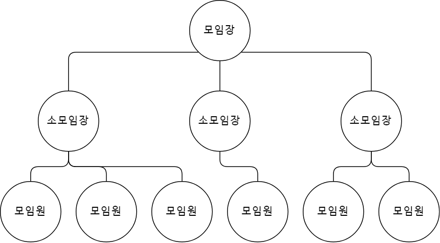
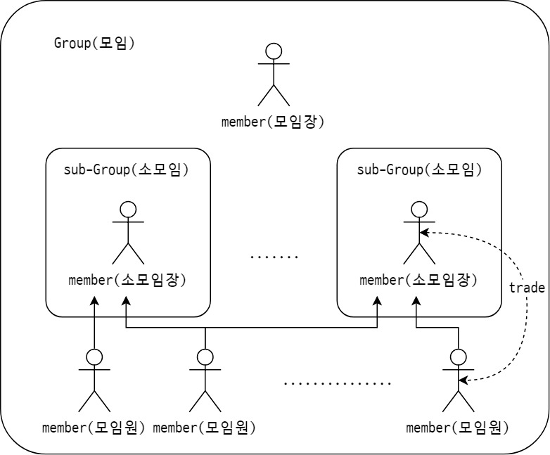

# Moim Manager (모임 관리자)

모임 관리에 필요한 기능을 제공하는 웹 서비스입니다.

## Environment
* OS : windows 10
* IDE : Intellij
* Language : Java (jdk 1.8)
* Framework : Spring boot 2.0.3

## Feature
* 벌금 관리
* 출석 및 과제 제출 관리

## 구성
### User(member)
1. 모임장
    * main - 1명
    
        * 해당 모임의 리더
        * 소모임장을 지명할 수 있다
        
    * sub - n명
    
        * 총무, 회계 등 모임장을 돕는 헬퍼.
        
2. 모임원

### Moim(group)

